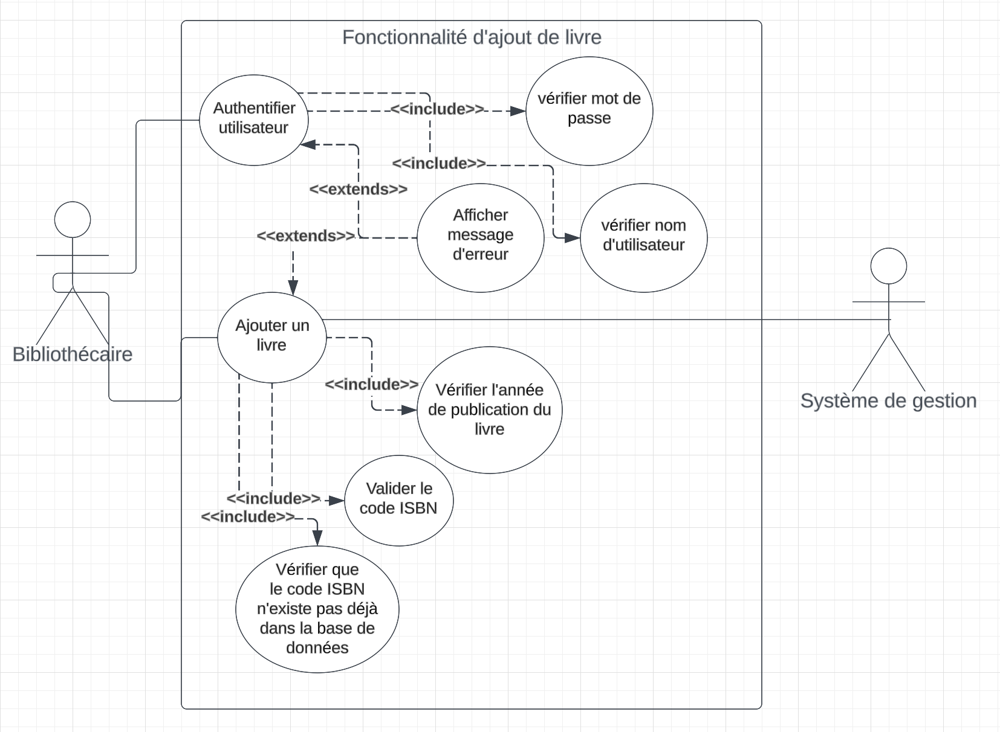
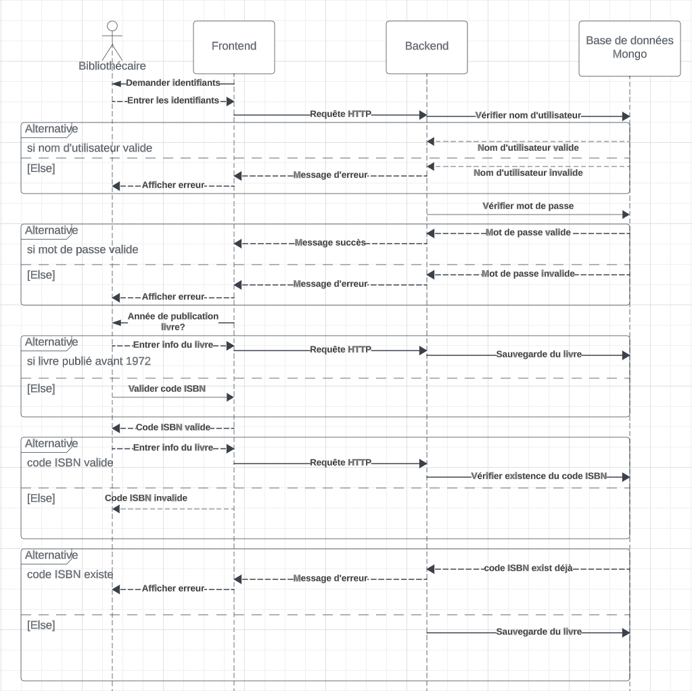

# Travail Pratique 2

## But

Rédiger une documentation qui explique l'implementation d'une nouvelle fonctionnalité pour une application web qui sera utilisée par des bibliothécaires.

## Problème

Les bibliothécaires aimeraient être en mesure de sauvegarder des nouveaux livres dans le système de gestion eux-mêmes.

## Contraintes

- Tous les livres sauvergadés dans le système doivent être identifiés avec un code ISBN valide sauf dans les cas des livres publiés avant 1972. Dans ce cas-là, le titre du livre sera utilisé comme identifiant principal du livre.

- Le système ne peut pas sauvegardés deux livres avec le même code ISBN.

- Chaque bibliothécaire doit être identifié avant de pouvoir ajouter un nouveau livre dans le système.

## Solution

### Backend

Créer et sauvegarder dans la base de données un identifiant avec nom d'utilisateur unique et mot de passe pour chaque bibliothécaire.

Implémentez le point de terminaison qui sera utilisé pour authentifier le bibliothécaire avant qu'il soit en mesure d'ajouter un nouveau livre. Ce point de terminaison vérifiera d'abord que le nom d'utilisateur reçu dans le corps de la requête existe dans la base de données. S'il existe, il vérifiera ensuite que le mot de passe reçu dans le corps de la requête correspond à celui enregistré pour le bibliothécaire dans la base de données. Si les mots de passe sont identiques, le point de terminaison renverra une réponse de succès. Si les mots de passe ne correspondent pas, le point de terminaison renverra un message d'erreur. Si le nom d'utilisateur reçu dans le corps de la requête n'existe pas, le point de terminaison renverra un message d'erreur au bibliothécaire.

Implémentez le point de terminaison qui sera utilisé pour sauvegarder les informations d'un livre dans la base de données. Ce point de terminaison vérifiera d'abord que le code ISBN reçu dans le corps de la requête n'existe pas déjà dans la base de données. S'il existe, il renverra un message indiquant à l'utilisateur que l'ISBN existe déjà et que la base de données ne peut pas contenir de données en double. Si le code ISBN n'existe pas dans la base de données, un nouveau document contenant les informations du livre sera créé et enregistré dans la base de données, puis le point de terminaison renverra une réponse de succès.

### Frontend

Implémentez un formulaire qui sera utilisé par le bibliothécaire pour se connecter avec ses identifiants. Ce formulaire enverra une requête au serveur pour authentifier le bibliothécaire. Si le serveur répond avec un message de succès, le bibliothécaire sera redirigé vers la page protégée uniquement accessible par les bibliothécaires authentifiés, afin qu'ils puissent ajouter un nouveau livre.

Dans le cas d'une réponse négative, le bibliothécaire aura 2 autres essais avant que son compte soit verrouillé et requiert l'intervention d'un administrateur du système qui va créer un nouveau mot de passe pour le bibliothécaire.

Implémentez un formulaire à plusieurs étapes qui, tout d'abord, demandera à l'utilisateur de valider si le livre a été publié avant 1972 ou non. Si le livre a été publié avant 1972, l'utilisateur sera invité à saisir des informations sur le livre telles que le titre, l'auteur, le genre, etc. Étant donné que le livre a été publié avant 1972, le champ du titre de ce formulaire sera obligatoire, et la validation du formulaire sera effectuée côté client avant l'envoi d'une requête HTTP au point de terminaison du serveur responsable de sauvegarder les informations du livre dans la base de données.

Si le livre n'a pas été publié avant 1972, l'utilisateur sera invité à saisir et valider le code ISBN. Ce code sera validé côté client. Si le code est valide, l'utilisateur sera ensuite invité à saisir des informations sur le livre telles que le titre, l'auteur, le genre, etc., puis à envoyer une requête HTTP au point de terminaison du serveur responsable de sauvegarder les informations du livre dans la base de données. Si le code ISBN n'est pas valide, l'utilisateur sera invité à fournir un code ISBN valide.

# Diagrammes

## Diagramme d'utilisation

## Diagramme de séquence

